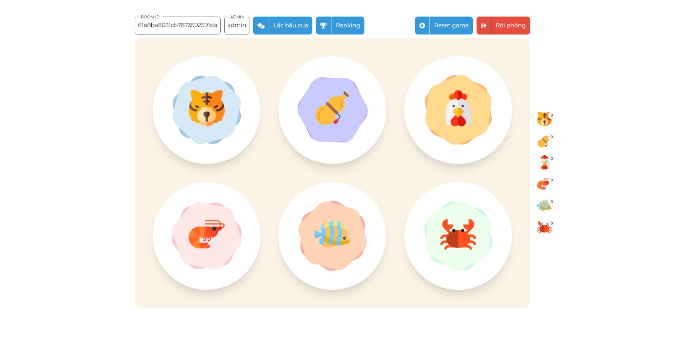
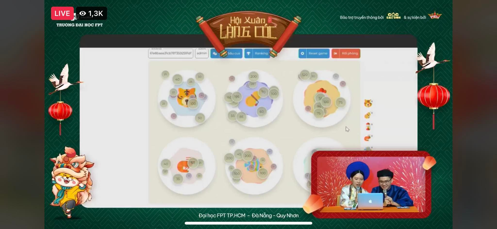
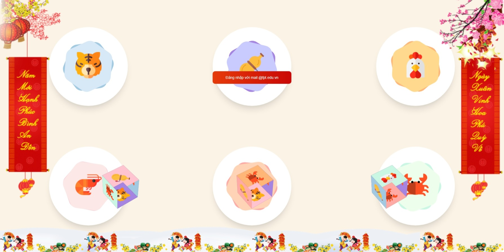

<h1>F-BauCua</h1>

This is the frontend of the game Bầu Cua Tôm Cá (Gourd Crab Shrimp Fish) which for the Lunar New Year event of FPT Univesity

Back-end repository: <a href="https://github.com/oHTGo/F-BauCua">Github</a>

<h2>In-game images</h2>

GameBoard

Faecbook livestream

Login screen

<h2>Tech</h2>
<ul>
    <li>ReactJS: create the UI</li>
    <li>Socket.io: realtime betting</li>
    <li>Firebase: for the login</li>
</ul>
<h2>Features</h2>
<ul>
    <li>Use school email to login via Google</li>
    <li>The game is divided into many rooms, each room will have a certain group of players</li>
    <li>Players will initially be given 200 coins to bet, winning or losing is calculated according to the rules of this game</li>
    <li>After the players finished betting, the admin can roll the dice, then calculate the winnings of the players</li>
    <li>After the end of 1 round, the admin resets the room, the players in the room will be reset to 200 to start playing again</li>
</ul>